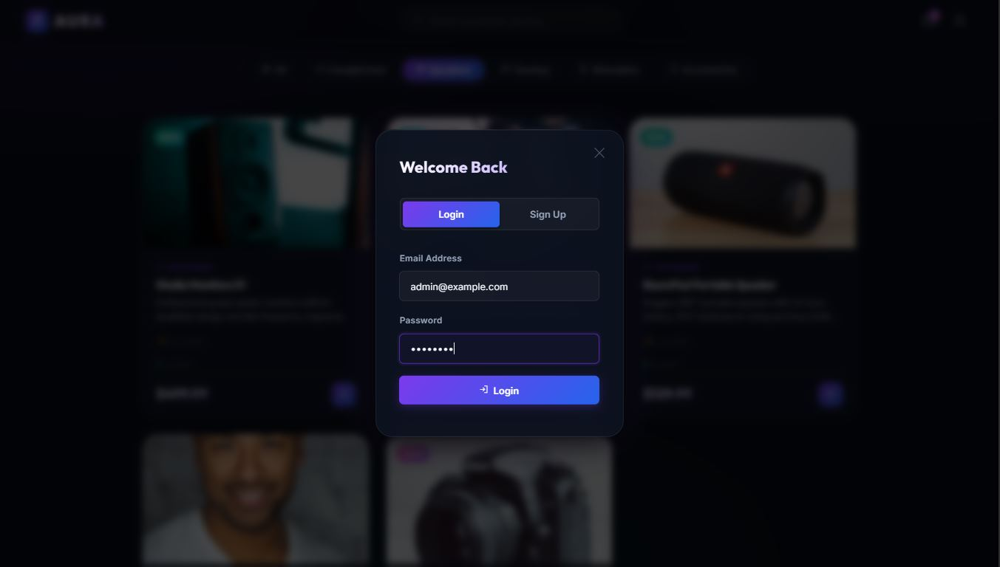
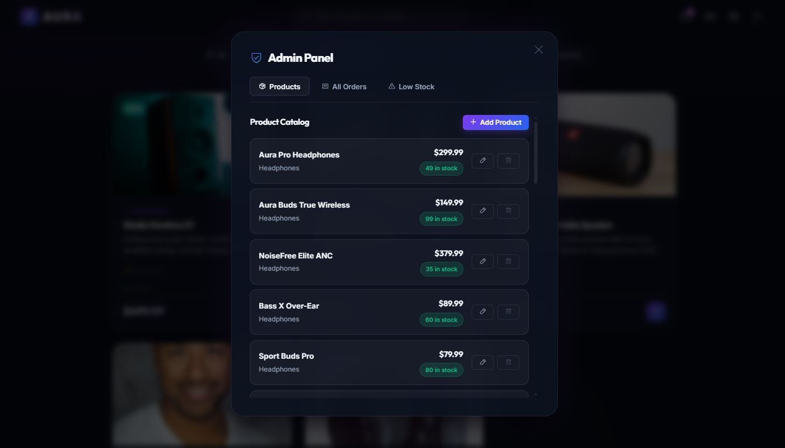
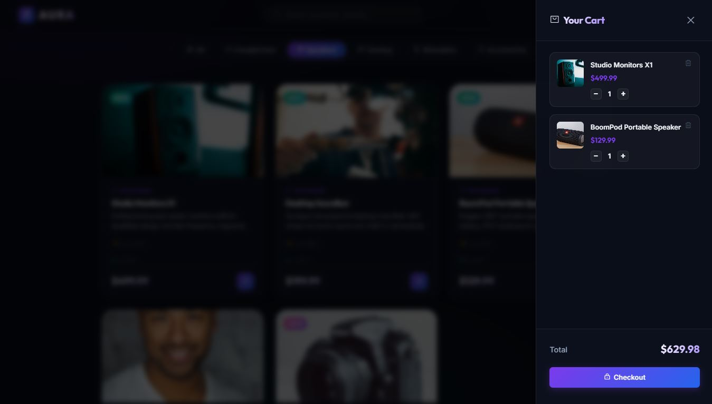
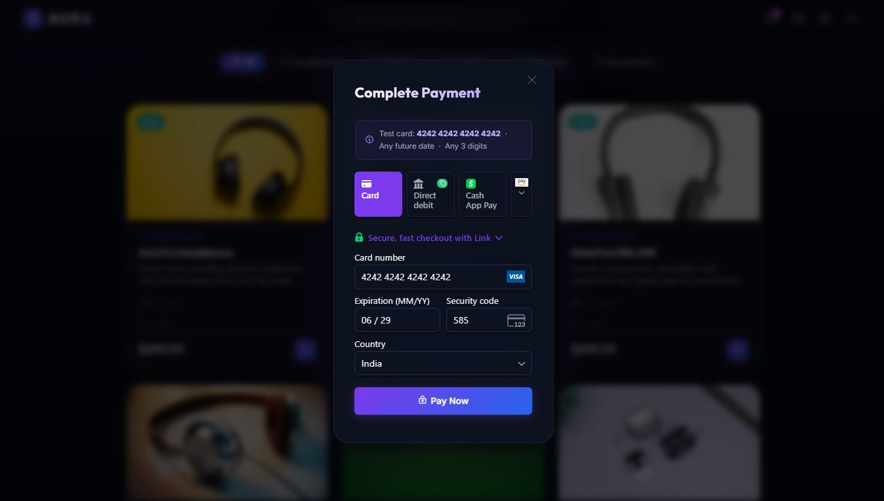
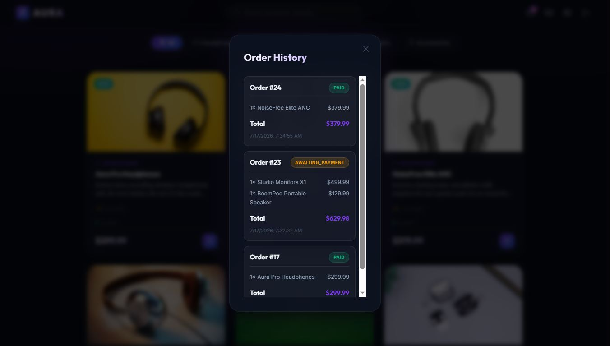

# Aura Commerce

A full-stack e-commerce platform — Flask REST API backend with a Vanilla HTML/CSS/JS frontend.
Supports user authentication, product catalog with search, shopping cart, order history, and
checkout with real Stripe payments (test mode).

Project spec: https://roadmap.sh/projects/ecommerce-api

## Screenshots

| | |
|---|---|
|  |  |
|  |  |
|  |  |
|  |  |
|  | |

## Architecture

```
Browser -> Static Frontend (HTML/CSS/JS, served separately)
              |  fetch (JWT in Authorization header)
        Flask App (Blueprints: auth, products, cart, orders, admin)
              |
        SQLAlchemy ORM
              |
        SQLite (dev) / PostgreSQL (prod-ready)

Payments -> Stripe API (PaymentIntent + Webhooks)
```

## Features

- **Auth**: signup/login with JWT (`Flask-JWT-Extended`), password hashing with bcrypt
- **Products**: CRUD (admin-only writes), search by name, filter by category/price, pagination
- **Cart**: add/update/remove items, stock validation
- **Checkout**: converts cart to an order, creates a Stripe PaymentIntent via Stripe Elements,
  decrements stock, confirms payment via webhook
- **Order History**: logged-in users can view their past orders
- **Admin**: view all orders, low-stock report, full product management UI
- **Frontend**: dark-mode glassmorphism UI, JWT session handling, cart sidebar, real Stripe
  Elements payment form, order history modal, admin panel
- **Tests**: pytest suite covering auth, permissions, cart, and stock edge cases

## Backend Setup

```bash
# 1. Create virtual environment
python -m venv venv
source venv/bin/activate  # Windows: venv\Scripts\activate

# 2. Install dependencies
pip install -r requirements.txt

# 3. Configure environment
cp .env.example .env
```

Edit `.env` and fill in real values -- **do not use the placeholders as-is**:

```dotenv
SECRET_KEY=<generate with the command below>
JWT_SECRET_KEY=<generate with the command below -- use a different value than SECRET_KEY>
DATABASE_URL=sqlite:///ecommerce.db
STRIPE_SECRET_KEY=sk_test_...      # from https://dashboard.stripe.com/test/apikeys
STRIPE_PUBLIC_KEY=pk_test_...      # from the same page
STRIPE_WEBHOOK_SECRET=whsec_...    # printed by `stripe listen`, see Webhooks section below
```

Generate strong random values for `SECRET_KEY` and `JWT_SECRET_KEY`:
```bash
python -c "import secrets; print(secrets.token_hex(32))"
```
Run it twice -- once per key -- so they're not identical.

```bash
# 4. Seed the database (creates tables + admin user + sample products)
python seed.py

# 5. Run the server
python run.py
```

Backend runs at `http://localhost:5000`. Default admin login: `admin@example.com` / `admin123`.

## Frontend Setup

The `frontend/` folder is a static HTML/CSS/JS client -- no build step required.

```bash
# From the project root, in a separate terminal (keep the backend running)
python -m http.server 8000 -d frontend
```

Open `http://localhost:8000` in your browser. The frontend talks to the backend at
`localhost:5000` (CORS is already configured on the Flask side).

## Stripe Webhooks (Local Testing)

Stripe needs to notify the backend when a payment completes. Locally, `localhost` isn't
publicly reachable, so use the **Stripe CLI** to forward events instead of the dashboard's
manual webhook setup.

1. Install the [Stripe CLI](https://github.com/stripe/stripe-cli/releases/latest) (no Scoop
   required -- download the Windows zip, extract, and run `stripe.exe` directly).
2. Authenticate:
   ```bash
   stripe login
   ```
3. Forward events to your local backend (keep this running while testing checkout):
   ```bash
   stripe listen --forward-to localhost:5000/webhook
   ```
4. Copy the printed `whsec_...` signing secret into `.env` as `STRIPE_WEBHOOK_SECRET`, then
   restart the Flask server so it picks up the change.

**Test card:** `4242 4242 4242 4242`, any future expiry, any CVC, any postal code.

## Running Tests

```bash
pytest tests/ -v
```

## API Reference

### Auth
| Method | Endpoint | Auth | Description |
|---|---|---|---|
| POST | `/api/auth/signup` | - | `{name, email, password, role?}` -> creates user, returns token |
| POST | `/api/auth/login` | - | `{email, password}` -> returns token |

### Products
| Method | Endpoint | Auth | Description |
|---|---|---|---|
| GET | `/api/products` | - | List products. Query: `search`, `category`, `min_price`, `max_price`, `page`, `per_page` |
| GET | `/api/products/<id>` | - | Get single product |
| POST | `/api/products` | Admin | Create product |
| PUT | `/api/products/<id>` | Admin | Update product |
| DELETE | `/api/products/<id>` | Admin | Delete product |

### Cart
| Method | Endpoint | Auth | Description |
|---|---|---|---|
| GET | `/api/cart` | User | View current cart + total |
| POST | `/api/cart/add` | User | `{product_id, quantity}` |
| PUT | `/api/cart/update/<item_id>` | User | `{quantity}` |
| DELETE | `/api/cart/remove/<item_id>` | User | Remove item |

### Orders / Checkout
| Method | Endpoint | Auth | Description |
|---|---|---|---|
| POST | `/api/orders/checkout` | User | Converts cart -> order, creates Stripe PaymentIntent |
| POST | `/api/orders/<id>/confirm` | User | Confirms payment status after frontend completes Stripe payment |
| GET | `/api/orders` | User | List own orders (order history) |
| GET | `/api/orders/<id>` | User | Get single order |
| POST | `/webhook` | - (Stripe signature) | Receives Stripe payment events, marks orders paid |

### Admin
| Method | Endpoint | Auth | Description |
|---|---|---|---|
| GET | `/api/admin/orders` | Admin | View all orders across all users |
| GET | `/api/admin/low-stock` | Admin | Products with stock <= 5 |

## Example: Full Flow with curl

```bash
# Sign up
curl -X POST localhost:5000/api/auth/signup -H "Content-Type: application/json" \
  -d '{"name":"Akash","email":"akash@test.com","password":"pass123"}'

# Browse products
curl localhost:5000/api/products?search=headphones

# Add to cart (replace TOKEN with access_token from signup response)
curl -X POST localhost:5000/api/cart/add -H "Content-Type: application/json" \
  -H "Authorization: Bearer TOKEN" -d '{"product_id":1,"quantity":2}'

# Checkout
curl -X POST localhost:5000/api/orders/checkout -H "Authorization: Bearer TOKEN"
```

## Design Notes

- **Stock is decremented at checkout**, not at cart-add -- prevents cart hoarding without a
  reservation system, at the cost of possible race conditions under high concurrency (documented
  trade-off, not fixed here -- would need row-level locking or a reservation queue for scale).
- **Prices are copied onto `OrderItem`** at purchase time (`price_at_purchase`) so historical
  orders remain accurate even if a product's price changes later.
- **Payment confirmation uses Stripe webhooks**, not just the frontend's success callback --
  webhooks are the source of truth since a client-side "success" can't be fully trusted (network
  drops, tab closes, etc. before confirmation reaches the server).
- **Stripe test mode only.** No live keys are used or should ever be committed to this repo.

## Security Notes

- `.env` is git-ignored and must never be committed. Use `.env.example` as the template for
  required variables.
- `SECRET_KEY` and `JWT_SECRET_KEY` must be distinct, randomly generated values -- never the
  placeholder text.
- Stripe **secret** keys (`sk_test_...` / `sk_live_...`) belong only in backend environment
  variables. The **publishable** key (`pk_test_...`) is the only Stripe key safe to expose in
  frontend JS.

## Future Work

- Rate limiting on auth endpoints
- Refresh tokens (currently access-token only)
- Support for redirect-based payment methods (Amazon Pay, etc.) via `return_url`, in addition
  to card payments
- Docker + docker-compose for one-command local setup
- Migrate SQLite -> PostgreSQL for production
